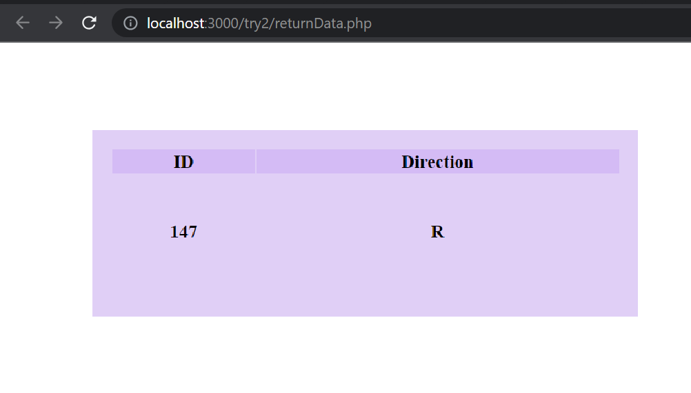

# Web-Based Robot Control Panel
#### Table of Content:-
* [About](https://github.com/code50/119280712/blob/main/Final-project/README.md#about-the-project)
* [Page1: Direction Controller](https://github.com/code50/119280712/blob/main/Final-project/README.md#page-1)
* [Page2: Drawing Robot Path](https://github.com/code50/119280712/blob/main/Final-project/README.md#page-2)
* [Page3: Last Entery](https://github.com/code50/119280712/blob/main/Final-project/README.md#page-3)
* [Page4: Speech Recognition](https://github.com/code50/119280712/blob/main/Final-project/README.md#page-4)
* [Unincluded Work](https://github.com/code50/119280712/blob/main/Final-project/README.md#unincluded-work)
* [Acknowloegment of Limitations](https://github.com/code50/119280712/blob/main/Final-project/README.md#acknowledgment-of-limitations)
* [Future Development](https://github.com/code50/119280712/blob/main/Final-project/README.md#future-development)
* [Used Languages](https://github.com/code50/119280712/blob/main/Final-project/README.md#implemented-using-%EF%B8%8F)
* [Resources](https://github.com/code50/119280712/blob/main/Final-project/README.md#resources-)

## About the Project
The project is a web-based robot control system with different functionalities spread across multiple pages. Each page serves a specific purpose in the overall system.
My project aims to demonstrate the user interface and functionality that will be later integrated with real-life hardware to control a physical robot.

### Project Purpose
This website is a personal project born out of a desire to integrate my computer science knowledge with the fascinating world of robotics. Having recently completed a short course on robotics, my interest in the field was piqued, and I sought a practical way to apply my programming skills. For me, this website is a practice ground, allowing me to experiment with web development and programming concepts. While I may not be an expert in hardware, the website provides a virtual environment where I can explore the integration of computer science principles with robotic control.

### Introduction Video
Youtube link: https://youtu.be/fpZUM-L8XnM

### Note
As of now, the website is a practice platform, and the robot control is simulated. The real-world implementation may require additional expertise in hardware, which is an area I aim to explore in the future. It is not only a coding exercise but also a reflection of my learning journeys. While the website may not have real-world applications yet, it serves as a stepping stone for potential future developments and practical implementations and it showcases and tests my knowledge.

## Page 1
### Controller

An interface to control the direction of the robot's movement. By clicking one of the buttons the chosen direction is sent as a single character `f,b,l,r,s` to `direction.php` as a POST request, and then the file will echo the character and store it in the database `my_robot`.

## Controller HTML Page
The controller page provides buttons for users to send different directions (forward, backward, left, right, stop) to the robot. Additionally, it includes a live chat widget for user support.

### Features
- User-friendly interface with directional buttons.
- Navigation bar for easy access to other pages.
- Chatbot for live chat support.

## PHP Script (direction.php)
The "direction.php" script handles form submissions from the controller page and inserts the direction into a MySQL database.
### Database Configuration
- Database Server: localhost:3307
- Database Name: my_robot
- Username: root
- Password: no password

### Usage
1. Ensure that the MySQL server is running.
2. Submit directions from "controller.html".
3. Check the "entry" table in the database for the recorded directions.

### Preview 🖥️

#### Hover:

#### PHP Page Preview
a page that shows the chosen direction after each user click -will be deleted later-  

### PhpMyAdmin:
<be />
Database: my_robot
 
Table: entry
 

## Page 2
### Path
A user interface to draw a map of the robot's path. Based on the user’s inputs the road map is drawn. The page is connected to the database to save the result. It is designed to provide a simple canvas for drawing the robot's path. It employs JavaScript to create an interactive drawing area, allowing users to visualize and plan the robot's route.

## Files and Directories
- path.html:
The main HTML file that defines the structure and content of the "Path " page. It Contains the canvas for drawing the robot's path and buttons for directional commands.
- style.css:
Stylesheet file responsible for the visual appearance and layout of the "Path" page.
- code.js:
JavaScript file containing functions for drawing on the canvas, handling user input, and controlling the robot's movement.
- ajax.js:
JavaScript file that includes AJAX functions for sending button values to the server asynchronously. It allows to send the button value to the server (direction2.php) when a button is clicked, and it logs the server's response.without refreshing the entire page

## ### Preview 🖥️

### Database:

## PAGE 3
## Latest Entry
The 'returnData.php' page is an interface that displays the last entry recorded in the database. It fetches the latest data from the 'entry' table and presents it in a tabular format on the webpage. It might not be clear why this page is important now but later on when the system is connected to hardware the information retrieved from this page will directly impact the physical movement of the robot. It will be the link between the virtual interface and the real-world actions of the robot.

## Files and Directories
- **returnData.php**: Main PHP file for the 'Latest Entry' page.
- **style.css**: Stylesheet for styling the table.
- **bootstrap.css** and **bootstrap-theme.css**: Bootstrap files for enhancing the visual style.
- **jquery-3.2.1.min.js** and **bootstrap.min.js**: JavaScript files for Bootstrap functionality.

### Last record
`returnData.php` retrieves the last record from the database  

## Page 4
### Speech Recognition

An interface to get user voice-orders using speech recognition. By starting the event the web browser will record the speech and it will be translated into text and sent to `send_meassage.php`, and will be stored in the database `my_robot`. These commands can be used later to control the robot.

## Files and Directories

- **index.html:** The main HTML file containing the structure of the speech detector page.
- **style.css:** The CSS file responsible for styling the elements on the pag.
- **script.js:** The JavaScript file that handles the speech recognition functionality, capturing user voice input, and sending it to the server for processing.
- **send_message.php:** The PHP script processing the received message from the speech detector. It sanitizes the message and inserts it into the database.

### Preview 🖥️

#### While listening:

#### After receiving the message
The message -recognized speech- will be shown after the event is done  

### Database:

## Unincluded Work

During the development of this project, I dedicated time and effort to crafting additional features and pages that, unfortunately, did not make it into the final release. While these elements are not part of the current version, I believe it's essential to acknowledge the work that went into their creation. Below, I briefly describe some of the notable elements that were left out:

### Temperature & Humidity Page
Knowing that the robot’s humidity and temperature are very important for robots and that they must be monitored to keep them working as intended, I wanted to create a H&T sensor for the robot. I did not have access to real hardware so I designed one using a simulator. However, I had a technical problem, since I was working on a local server it was not possible to link the simulator to my database. In the real scenario, I would be working with a physical ESP32 and sensor, and connecting that to my local Wi-Fi and XAMPP server. But, I do not have access to an ESP. So, I used the Wokwi website to simulate the circuit. Nevertheless, Wokwi does not support direct HTTP requests to external APIs. So, I wrote a Python code to generate data, which then can be used as data readings on the web page.

#### The circuit

#### H&T sensor Page
This page takes randomly generated data from  `data_generator.py` which serves as readings from an actual sensor.

#### H&T readings page
This PHP page `reading.php` retrieves the latest entries from the database.

#### Database Preview

* I decided not to include it because I believe it does not add any value since the readings are completely random and the user has no input nor is he gaining any valuable info from it.

## Acknowledgment of Limitations
It's crucial to recognize that the current project's scope was shaped by the constraints of a minimal timeframe, dictated by work commitments and academic responsibilities during exam season. Even though the course has a more flexible schedule, unfortunately, mine was not and I was given a very short time to complete it.   Despite these challenges, the delivered solution represents a testament to adaptability and efficiency. I did the best I could with the time I was given I just want to address that I purposefully focused on the functionalities rather than design to make sure I learned as much as possible. Everything I skipped is something I believe I can do if I had more time so I hope this acknowledgment can be taken into consideration.

## Future Development
Given more time, there exists a wealth of untapped potential for this project. The current iteration represents a snapshot of what could be achieved within the allocated timeframe. With additional resources and a more extended development period, there are several areas where enhancements and expansions could be explored.

### Areas for Further Development
- Feature Expansion: Numerous features could be added to enrich the user experience and extend the functionality of the website.
- Optimization: Fine-tuning and optimizing the codebase could improve performance and scalability.
- User Interface Refinement: While the current user interface meets the basic requirements, dedicating more time would allow for a more polished and aesthetically pleasing design.
- Responsive Design: Implementing a more comprehensive responsive design to cater to a wider array of screen sizes, including mobile devices and tablets.
- Cross-Browser Compatibility: Conducting additional testing across various web browsers to ensure consistent functionality and appearance.

### Future Development
The project roadmap includes the following:
- Integration with real robot hardware.
- Additional features for enhanced robot control.
- Improved user interface and experience.

## Implemented using 🛠️:
* HTML, CSS, JS
* PHP
* SQL
* Python
   -so far-

## Resources :
- https://www.w3schools.com
- https://fontawesome.com
- https://stackoverflow.com
- https://pbphpsolutions.com/
- https://cs50.harvard.edu/x/2023/
   -so far-
